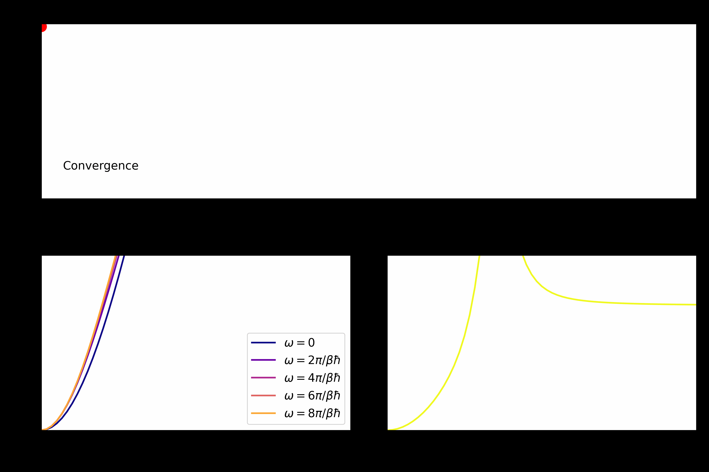

# Qupled: quantum plasmas and dielectric formalism

Qupled is a python package that can be used to compute the properties of quantum plasmas via the dielectric formalism. The plasma properties can be computed to arbitrary precision by leveraging on a simple Python interface combined with the speed of C++

<p align="center">

<p>
 
## Building & running

Qupled can be compiled with `cmake`, tested with `pytest` and installed with the following procedure

```bash
git clone git@github.com:fedluc/qupled.git
cd qupled
mkdir build
cd build
cmake -DCMAKE_BUILD_TYPE=Release ..
cmake --build .
pytest tests
cmake --install .
```
After installation Qupled can be used as a regular Python package

```python
import qupled.classic as qpc

# Solve the stls dielectric scheme
stls = qpc.Stls(10.0, # Coupling parameter
                1.0,  # Degeneracy parameter
                mixing = 0.5,
                cutoff = 10)
stls.compute()
```

## Documentation

More detailed information on the package together with a list of examples is available in the [documentation](http://qupled.readthedocs.io/)

## Publications

Qupled has been used in the following publications:

``` bibtex
@article{tolias2021integral,
  title={Integral equation theory based dielectric scheme for strongly coupled electron liquids},
  author={Tolias, Panagiotis and Lucco Castello, F and Dornheim, Tobias},
  journal={The Journal of Chemical Physics},
  volume={155},
  number={13},
  year={2021},
  publisher={AIP Publishing}
}

@article{tolias2023quantum,
  title={Quantum version of the integral equation theory-based dielectric scheme for strongly coupled electron liquids},
  author={Tolias, Panagiotis and Lucco Castello, Federico and Dornheim, Tobias},
  journal={The Journal of Chemical Physics},
  volume={158},
  number={14},
  year={2023},
  publisher={AIP Publishing}
}

@article{tolias2024revisiting,
  title={Revisiting the Vashishta-Singwi dielectric scheme for the warm dense uniform electron fluid},
  author={Tolias, Panagiotis and Castello, Federico Lucco and Kalkavouras, Fotios and Dornheim, Tobias},
  journal={arXiv preprint arXiv:2401.08502},
  year={2024}
}

```
